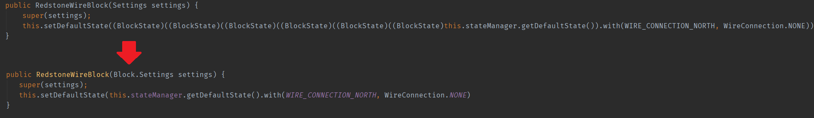
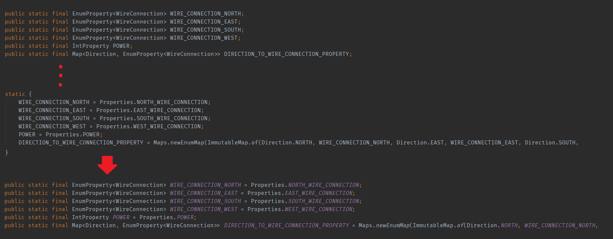

# ForgedFlowerLoom

ForgedFlowerLoom allows decompiling Minecraft sources in Loom with ForgedFlower instead of FabricFlower.</br>
ForgedFlower (a fork of ForgeFlower) can produce significantly better output than FabricFlower in some cases and reduces compilation errors in resulting code.</br>
As of version 2.0.0 ForgedFlower is also multithreaded, making it as fast as FabricFlower.

## Usage
ForgedFlowerLoom requires loom 0.4 or above.
Add ForgedFlowerLoom as a gradle plugin, below loom:
```groovy
plugins {
    id 'fabric-loom' version '0.4-SNAPSHOT'
    id "com.github.fudge.forgedflowerloom" version "2.0.0"
}
```

From now on, if you wish to decompile using ForgedFlower, use the `genSourcesWithForgedFlower` task (`gradlew genSourcesWithForgedFlower`) instead of `genSources`. A source jar will be generated using ForgedFlower that you can attach as normal.

## Output examples





