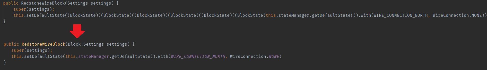
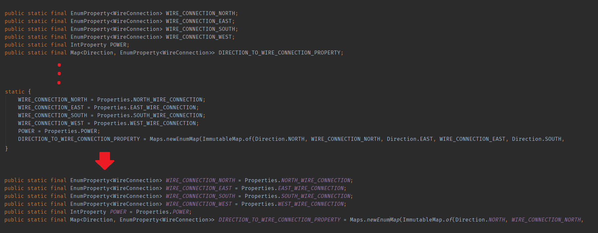
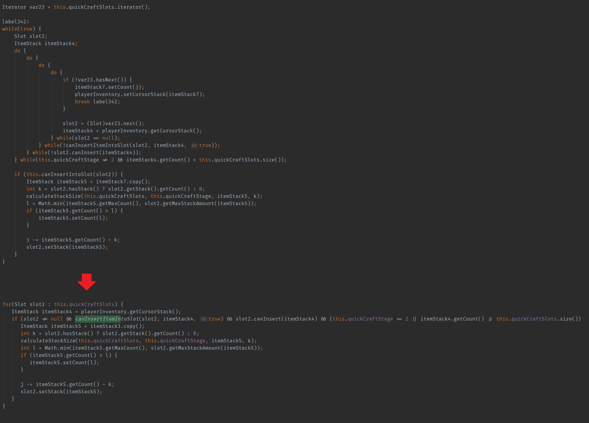

# ForgedFlowerLoom

ForgedFlowerLoom allows decompiling Minecraft sources in Loom with ForgedFlower instead of FabricFlower.
ForgedFlower (a fork of ForgeFlower) can produce significantly better output than FabricFlower in some cases and reduces compilation errors in resulting code.
A downside is that ForgedFlower is not multithreaded.

## Usage

Place **at the very top of your `build.gradle`, above `plugins`**:

```groovy
buildscript {
   repositories { jcenter() }
   dependencies {
       classpath("io.github.fudge:forgedflowerloom:${version}")
   }
}
```

And then **anywhere after the `plugins` block**, in the same `build.gradle`:

```groovy
minecraft {
   addDecompiler(new ForgedFlowerDecompiler(project))
}
```

From now on, if you wish to decompile using ForgedFlower, use the `genSourcesWithForgedFlower` task (`gradlew genSourcesWithForgedFlower`) instead of `genSources`. A source jar will be generated using ForgedFlower that you can attach as normal.

## Output examples



 

